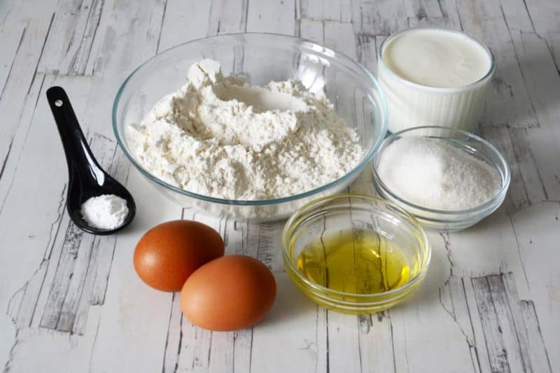

[< на главную страницу](./readme.md)

## Ингредиенты    

+ **творог** - 200г
+ **сахар** - 1ст.л.
+ **соль** - на кончике ножа
+ **ванильный сахар** - 1ч.л.
+ **яйцо** - 1шт.
+ **мука** - 1ст.л+2-ст.л. *для раскатывания теста и панировки сырников*
+ **растительное масло** - 2-3ст.л.

 