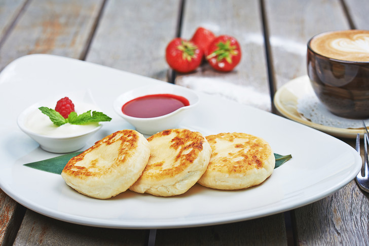

[ < на главную страницу](./readme.md)

[ < назад](./ingredients-2.md)

# Приготовление

1. ### Делаем однородную массу: смешиваем творог, желток, муку, сахарную пудру, соль, ванилин.
2. ### Далее делаем из этой массы круглые шарики по 50-60 гр., панируем их в муке, обжариваем на топленом масле с двух сторон.
3. ### Потом ставим в духовку на 2-3 мин. на 180 градусов.
4. ### Сырники подать можно с вареньем, сметаной, сгущеным молоком.
___

___