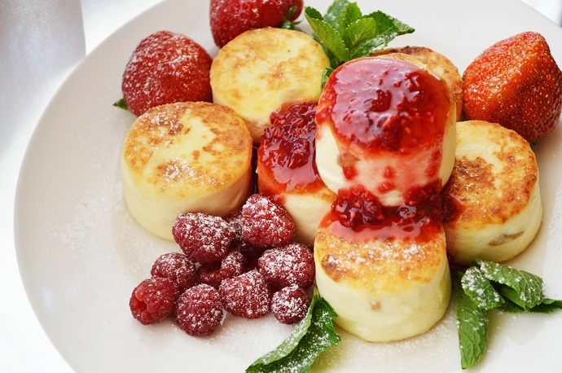

[ < на главную страницу](./readme.md)

[ < назад](./ingredients-3.md)

# Приготовление 

1. ### Все ингредиенты (кроме масла и мяты) смешать до однородной массы. Сформировать в форме биточков и обжарить на растительном масле.
2. ### Довести до готовности в духовке при t—180 градусов в течение 5 минут.
3. ### Подавать в рокс-бокале, выкладывая слоями, сметану, варенье, сырник, сметану, варенье, сырник и т.д.
___

___
