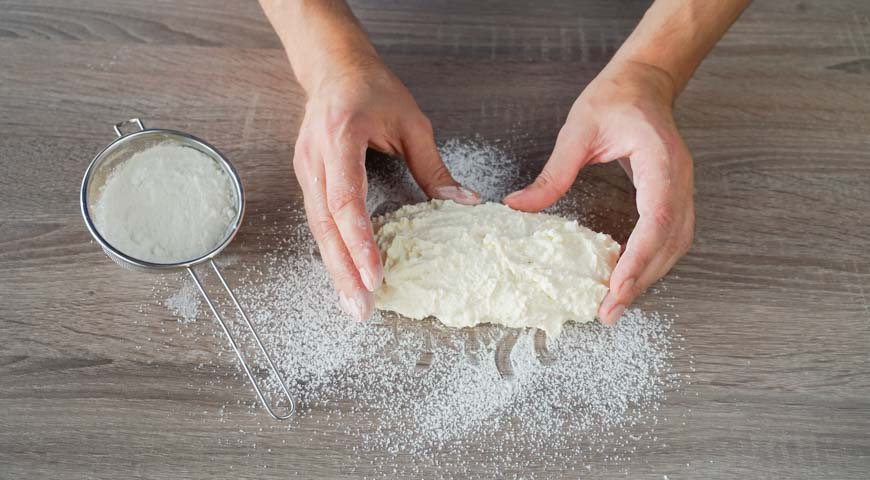
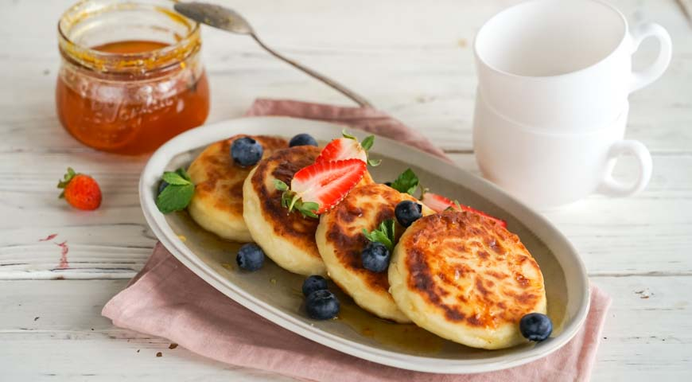

[< на главную страницу](./readme.md)

# Шаг 1

***Приготовьте тесто для домашних сырников. Для этого творог протрите через частое сито в миску. Если творог слишком влажный, откиньте его на марлю, сложенную вчетверо, и отожмите.***
___

# Шаг 2 

***В миску с творогом добавьте обычный и ванильный сахар, а также соль. Перемешайте.***
___

# Шаг 3

***Яйцо взбейте венчиком. Добавьте в творожную массу и перемешайте лопаточкой или вилкой.***

___

# Шаг 4 

***В творожную массу всыпьте муку. Перемешивайте лопаточкой до получения теста однородной гладкой консистенции. Миску с тестом для сырников уберите на 15 минут в холодильник.***
___

# Шаг 5

***Стол присыпьте мукой. Выложите творожное тесто для домашних сырников и сформируйте из него толстую колбаску диаметром примерно 5 см. Если муку недостаточно, добавьте еще немного и перемешайте.***

___

# Шаг 6 

***Получившуюся «колбаску» нарежьте кружочками толщиной не более 1,5 см. Каждый обваляйте в муке и оставьте на столе, присыпанном мукой, до использования.***

___

# Шаг 7 

***В большой сковороде диаметром 24-26 см хорошо нагрейте растительное масло. Выложите в нее сырники и жарьте по 2 минуты с каждой стороны до румяной корочки.***

___

# Шаг 8 

***Сковороду с домашними сырниками накройте крышкой и держите на слабом огне 3 минуты. На стол подайте горячими, дополнив сметаной, сгущенным молоком, вареньем или джемом.***

___