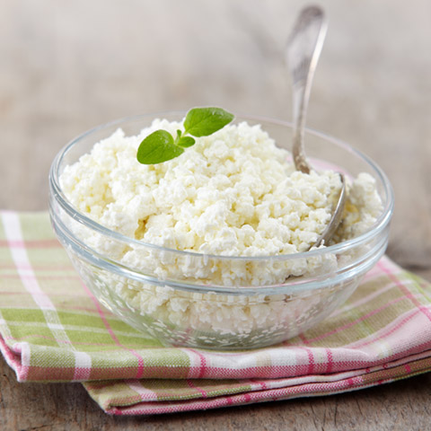

# Примечание
[ < назад](./Ingredients.md)

***Манка, в отличие от пшеничной муки, не утяжеляет тесто и не делает его структуру резиновой. Потому ею можно частично или полностью заменить в тесте муку. Только помните, что манке требуется больше времени для разбухания, так что не торопитесь переходить к жарке сразу после замешивания теста. Дайте ему постоять хотя бы 15 минут.***
___

***Для жарки сырников выбирайте сковороду толстым дном, т.к. на тонких сковородках тесто будет быстро подгорать.***

***Если Перед тем, как выложить сырники на сковороду, хорошо раскалите масло. оно будет недостаточно горячим - не получится хрустящей корочки, а тесто в впитает в себя лишний жир.***

***Жарить лучше всего на медленном огне, счтобы сырники хорошо пропеклись в середине и не подгорели при этом снаружи.***

***Отличный вариант для диетической кухни - сырники, испеченные в духовке, ведь в этом случае не требуется масло. Только не забудьте добавить в тесто немного (буквально на кончике ножа) разрыхлителя. И ещё одна тонкость - после выпекания не торопитесь вынимать сырники из духовки, иначе они опадут. Дайте им постоять ещё пять минут и только после этого открывайте дверцу духовки.***

***И напоследок два рецепта вкусных сырников - сладких и соленых.***
___

