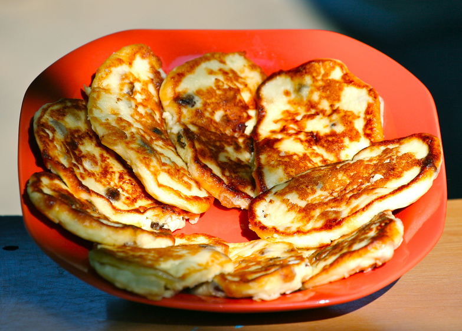

# Рецепт сырников

LICENSE: [MIT](./license.md)

---
### Сырники домашние
The photo by Juerg Vollmer - http://surl.li/bibpt , licenset: [CC BY 3.0](https://creativecommons.org/licenses/by/3.0/)

---

Сырники домашние — блюдо по-особому теплое, вызывающее самые приятные ассоциации. Некоторые спрашивают, почему их называют именно так, ведь главный ингредиент блюда вовсе не сыр, а творог. Дело в том, что хорошо знакомое нам название этого кисломолочного продукта получилось только в XVIII веке. До этого же времени в России творог называли просто «сыр», а блюда из него — «сырными» (в старых книгах, например, пасха именуется именно «сырной»). Кстати, толстые творожные оладушки (то есть домашние сырники) готовили в нашей стране издавна: например, их подавали на масленицу наряду с пышными дрожжевыми блинами или тонкими блинчиками.

## [*Ингредиенты*](./Ingredients.md)
## [*Полезный Совет*](./tip1.md)

---

# ПОШАГОВЫЙ РЕЦЕПТ ПРИГОТОВЛЕНИЯ - [Шаг-1:](./cookingprocess.md)

[Оригинальный источник](https://www.gastronom.ru/recipe/4900/syrniki)

