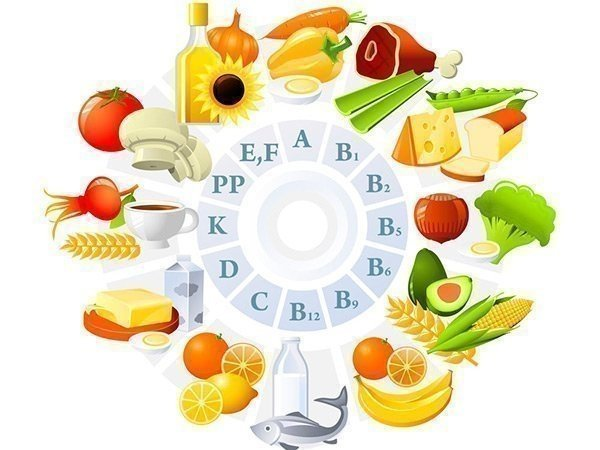

[на главную страницу](./readme.md)

# Пищевая энергетическая ценность

 > **Количество калорий** - 249,1 ккал

 > **Белки** - 10.6г

 > **Жиры** - 16.4г

 > **Углеводы** - 14,4 г

### [*Почему важно знать пищевую ценность*](./vazhnoznat.md)

*Источник - "Коллекция рецептов"
#8 (16), 2007*